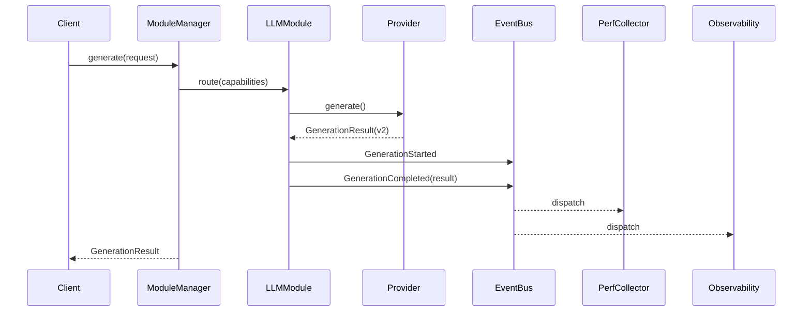

# Application Map

Высокоуровневое представление компонентов ядра и модулей. Диаграммы служат когнитивной картой: где проходят основные потоки данных и событий.

## Component Graph

```mermaid
graph TD
  subgraph Kernel
    ConfigService[[ConfigService]]
    ModuleManager[[ModuleManager]]
    EventBus[[EventBus (v1 planned)]]
    ServiceRegistry[[ServiceRegistry]]
  end

  subgraph Modules
    LLM[LLM Module]
    PerfCollector[PerfCollector (opt)]
    Observability[Observability (TBD)]
    Memory[Memory (TBD)]
    RAG[RAG (TBD)]
    Evaluation[Evaluation (Future)]
  end

  ConfigService --> ModuleManager
  ModuleManager -->|lazy load| LLM
  ModuleManager --> PerfCollector
  ModuleManager --> Observability
  ModuleManager --> Memory
  ModuleManager --> RAG
  LLM -->|Generation* events| EventBus
  PerfCollector -->|subscribes| EventBus
  Observability -->|subscribes all| EventBus
  Memory -->|future ingest/store events| EventBus
  RAG -->|retrieval requests| Memory
  RAG -->|augmented prompts| LLM
  EventBus --> ServiceRegistry
  ServiceRegistry --> Modules
```

## Generation Sequence (Planned v2 Contract)



## Legend

| Тип | Значение |
|-----|----------|
| Solid arrow | Синхронный вызов / зависимость |
| Dashed arrow | Планируемое расширение / подписка |
| (TBD) | Заглушка, ещё не реализовано |
| (opt) | Опциональный модуль |

## Notes

- EventBus v1: синхронная диспетчеризация в памяти; v2 (later) добавит async очередь (см. ADR-0011).
- ServiceRegistry: lookup по capability (будет формализовано отдельно).
- PerfCollector изолирован (события + GenerationResult, см. ADR-0012).
